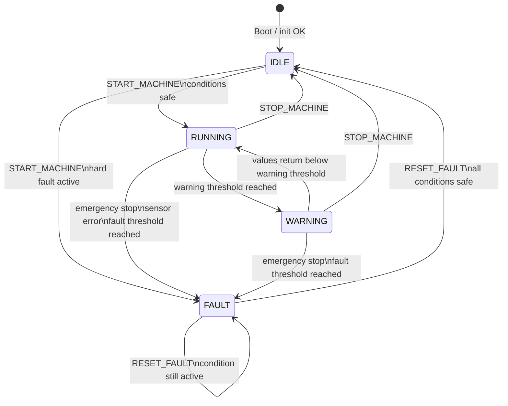

# Machine Monitoring Edge Gateway

Embedded Linux edge gateway running on a Raspberry Pi 5 with custom Yocto images.

The gateway is the middle layer between the STM32 machine I/O node and the Qt/QML HMI. It communicates with the STM32 over UART, converts machine status frames into structured telemetry, exposes the data through ROS2, and provides ROS2 services for machine control.

This repository also contains a Factory Image flow that simulates an embedded production/manufacturing process. The Factory Image validates the STM32 hardware, mounts runtime software from NFS, verifies the image checksum, flashes the runtime root filesystem into a runtime slot, stores factory reports on a persistent data partition, and can switch the next boot target to the runtime slot.

## Project Goal

This project demonstrates an embedded Linux edge gateway for a small industrial-style machine monitoring system.

It combines:

* Raspberry Pi 5
* Custom Yocto Linux images
* Factory Image and Runtime Image separation
* GPT-based SD-card partition layout
* Runtime rootfs flashing from NFS
* Manifest and SHA256 validation
* Persistent factory reports
* C++ gateway application
* UART communication with STM32
* Unix socket IPC
* ROS2 Jazzy telemetry and services
* systemd services for automatic startup
* Host-to-target ROS2 communication over Ethernet
* Integration with a Qt/QML HMI

## System Architecture

```text
+------------------------------+
| Qt/QML HMI                   |
| - Live telemetry dashboard   |
| - Machine controls           |
| - Load threshold settings    |
+---------------+--------------+
                |
                | ROS2 over Ethernet
                v
+---------------+--------------+
| Raspberry Pi 5 Edge Gateway  |
| Yocto Runtime Image          |
|                              |
| ros2-stm32-bridge            |
| - /machine/telemetry         |
| - ROS2 services              |
|                              |
| edge-gateway                 |
| - UART manager               |
| - STM32 protocol parser      |
| - Unix socket IPC server     |
| - command forwarding         |
+---------------+--------------+
                |
                | USART1 / UART
                v
+---------------+--------------+
| STM32 Machine I/O Node       |
| - DHT11 temperature/humidity |
| - Load input                 |
| - Fan PWM + RPM feedback     |
| - Emergency stop input       |
| - Status LED outputs         |
| - Machine state/fault logic  |
| - Optional vibration fields  |
+------------------------------+
```

## Factory Image Flow

The Factory Image is a separate Yocto image used to simulate a production/manufacturing process.

```text
Raspberry Pi boots Factory Image
        |
        v
Factory Image starts factory-image.service
        |
        v
Check target environment
        |
        v
Mount persistent data partition at /data
        |
        v
Check Ethernet interface
        |
        v
Check STM32 UART device
        |
        v
Run STM32 factory hardware test
        |
        v
Mount customer software NFS export
        |
        v
Check manifest.json and runtime-rootfs.ext3
        |
        v
Validate runtime image SHA256 checksum
        |
        v
Prepare runtimeA partition flashing target
        |
        v
Flash runtime-rootfs.ext3 to runtimeA if enabled
        |
        v
Switch boot target to runtimeA if enabled
        |
        v
Save factory report to /data/factory-reports
```

The Factory Image is not the normal customer/runtime software. It is a temporary production image used to validate hardware and install the runtime software.

## Factory vs Runtime Image

This project now has two Yocto images.

### Factory Image

Recipe:

```text
meta-anas-edge/recipes-core/images/machine-monitoring-factory-image.bb
```

Purpose:

* Boots first during factory/manufacturing phase
* Runs STM32 hardware validation
* Mounts runtime software from NFS
* Validates `manifest.json`
* Validates SHA256 checksum of `runtime-rootfs.ext3`
* Flashes runtime rootfs to `runtimeA`
* Can switch boot target to runtimeA
* Saves reports to persistent `/data`

Main package:

```text
factory-image
factory-stm32-check
```

### Runtime Image

Recipe:

```text
meta-anas-edge/recipes-core/images/machine-monitoring-runtime-image.bb
```

Purpose:

* Normal customer/runtime software
* Runs `edge-gateway`
* Runs `ros2-stm32-bridge`
* Publishes telemetry to ROS2
* Provides ROS2 services
* Communicates with STM32 over UART

Main packages:

```text
edge-gateway
ros2-stm32-bridge
machine-interfaces
```

## SD-card Partition Layout

The Factory Image uses a custom WIC layout:

```text
meta-anas-edge/wic/machine-monitoring-factory-image.wks
```

Expected SD-card layout:

```text
/dev/mmcblk0p1 = boot      -> Raspberry Pi boot partition
/dev/mmcblk0p2 = factory   -> Factory Image rootfs
/dev/mmcblk0p3 = runtimeA  -> Runtime slot A
/dev/mmcblk0p4 = runtimeB  -> Runtime slot B
/dev/mmcblk0p5 = data      -> Persistent data partition
```

The WIC file uses GPT:

```text
bootloader --ptable gpt
```

GPT partition names are used through `/dev/disk/by-partlabel`.

Example:

```text
/dev/disk/by-partlabel/boot
/dev/disk/by-partlabel/factory
/dev/disk/by-partlabel/runtimeA
/dev/disk/by-partlabel/runtimeB
/dev/disk/by-partlabel/data
```

This is important because filesystem labels can disappear after flashing a full rootfs image with `dd`, but GPT partition names remain in the partition table.

## Factory Runtime Installation Input

The Factory Image expects runtime software from the host PC through NFS.

Host export:

```text
/export/customer-software
```

Expected files:

```text
/export/customer-software/runtime-rootfs.ext3
/export/customer-software/manifest.json
```

Example `manifest.json`:

```json
{
  "version": "0.1.0",
  "image": "runtime-rootfs.ext3",
  "sha256": "29b6577cd5d9ba32fc95bf93c8f8bc489265c048912f564f7a874bc56969b2b6"
}
```

The Factory Image checks:

```text
manifest.json exists
runtime-rootfs.ext3 exists
manifest image field matches runtime-rootfs.ext3
manifest sha256 field exists
actual SHA256 equals expected SHA256
```

## Factory Image Safety Guards

The Factory Image script contains two important safety flags:

```sh
FLASHING_ENABLED="0"
BOOT_SWITCH_ENABLED="0"
```

By default, both should stay disabled.

### Flashing Guard

When:

```sh
FLASHING_ENABLED="0"
```

the script only performs a dry run:

```text
DRY-RUN: flashing is disabled
DRY-RUN: would flash /mnt/customer-software/runtime-rootfs.ext3 to /dev/mmcblk0p3
```

When:

```sh
FLASHING_ENABLED="1"
```

the script writes the runtime rootfs to `runtimeA`:

```sh
dd if="${RUNTIME_IMAGE_FILE}" of="${RUNTIME_SLOT_A_REAL_DEVICE}" bs=4M status=progress conv=fsync
sync
```

The script checks before flashing:

* runtimeA exists by GPT PARTLABEL
* runtimeA is not the currently booted rootfs
* runtimeA is not mounted
* runtime image size fits inside runtimeA partition

### Boot Switch Guard

When:

```sh
BOOT_SWITCH_ENABLED="0"
```

the script only logs what it would do.

When:

```sh
BOOT_SWITCH_ENABLED="1"
```

the script updates:

```text
/boot/cmdline.txt
```

and replaces the current root target with:

```text
root=PARTUUID=<runtimeA PARTUUID>
```

A backup is saved as:

```text
/boot/cmdline.factory.backup
```

This mechanism was used to validate the boot switch before adding U-Boot.

## Persistent Factory Reports

The Factory Image mounts the persistent data partition at:

```text
/data
```

Factory reports are copied to:

```text
/data/factory-reports
```

Example:

```text
/data/factory-reports/factory-image-20260826-142400.log
```

This allows factory reports to survive runtime slot flashing.

## Related Repositories

```text
STM32 firmware : https://github.com/anasmansouri/stm32-machine-io-node
Qt/QML HMI     : https://github.com/anasmansouri/machine-monitoring-hmi
```

## Current Hardware Status

The current demo hardware uses:

* STM32 machine I/O node
* DHT11 temperature/humidity sensor
* Load input through ADC
* 4-pin PWM fan with tachometer/RPM feedback
* Emergency stop input
* Red/yellow/green status LED module
* UART link between STM32 and Raspberry Pi
* Raspberry Pi 5 running the Yocto gateway image

The ADXL345 vibration sensor was used earlier and the gateway still supports the vibration telemetry fields for compatibility. In the current hardware demo, vibration values can be kept as `0` when the sensor is disabled on the STM32 side.

## Main Components

### 1. common-utils

Shared C++ utility library.

Contains:

* `Result`
* common error handling helpers

This library is used by other C++ components.

### 2. stm32-comm

Shared C++ STM32 communication library.

Contains:

* UART manager
* STM32 protocol parser

It depends on:

```text
common-utils
```

This library is used by:

* `edge-gateway`
* `factory-stm32-check`

### 3. edge-gateway

C++ application running on the Raspberry Pi runtime image.

Responsibilities:

* Open and configure the UART device
* Handshake with STM32 using `PING`
* Poll STM32 using `GET_STATUS`
* Parse STM32 `STATUS` frames
* Convert telemetry into JSON snapshots
* Publish snapshots over a Unix socket
* Forward command requests to STM32
* Continue running even if the STM32 is temporarily offline

### 4. factory-stm32-check

Small C++ tool used by the Factory Image.

Responsibilities:

* Open UART to STM32
* Send `PING`
* Verify STM32 replies with `ACK:PING`
* Send `GET_STATUS`
* Parse the returned status frame
* Pass only if required factory conditions are valid

Factory pass conditions include:

```text
DHT_STATUS=DHT_OK
LOAD_STATUS=LOAD_OK
OPERATING_MODE=AUTO_MODE
FAULT=FAULT_NONE
```

If the check fails, the Factory Image marks the STM32 board as failed in the factory hardware test.

### 5. factory-image

Shell-based Factory Image flow.

Responsibilities:

* Mount `/data`
* Run STM32 hardware test
* Mount NFS export
* Validate manifest
* Verify SHA256 checksum
* Prepare runtimeA flashing target
* Flash runtime image if enabled
* Switch boot target if enabled
* Save persistent factory report

### 6. ros2-stm32-bridge

ROS2 C++ node.

Responsibilities:

* Read telemetry JSON from the gateway IPC socket
* Publish machine telemetry on `/machine/telemetry`
* Provide ROS2 services for machine control
* Forward service requests to the gateway command socket
* Reconnect when the gateway socket is temporarily unavailable

### 7. machine_interfaces

Custom ROS2 interface package.

It contains:

* `machine_interfaces/msg/MachineTelemetry`
* `machine_interfaces/srv/SetThreshold`

`SetThreshold` is used for configurable warning/fault thresholds such as load threshold and optional vibration threshold.

## Telemetry Pipeline

```text
STM32 sensors and machine state
  -> UART STATUS response
  -> Raspberry Pi edge-gateway
  -> Unix socket JSON snapshot
  -> ros2-stm32-bridge
  -> ROS2 topic /machine/telemetry
  -> Qt/QML HMI
```

Example JSON snapshot:

```json
{
  "type": "machine_snapshot",
  "temperature": 27,
  "humidity": 62,
  "load": 28,
  "fan_rpm": 1200,
  "vibration_x_mg": 0,
  "vibration_y_mg": 0,
  "vibration_z_mg": 0,
  "vibration_level_mg": 0,
  "emergency_button": false,
  "state": "MACHINE_STATE_IDLE",
  "fault": "FAULT_NONE",
  "operating_mode": "AUTO_MODE",
  "dht_status": "DHT_OK",
  "load_status": "LOAD_OK"
}
```

## ROS2 Interfaces

### Topic

```text
/machine/telemetry
```

Message type:

```text
machine_interfaces/msg/MachineTelemetry
```

Fields:

```text
int32 temperature
int32 humidity
int32 load
uint32 fan_rpm
int32 vibration_x_mg
int32 vibration_y_mg
int32 vibration_z_mg
int32 vibration_level_mg
bool emergency_button
string state
string fault
string operating_mode
string dht_status
string load_status
```

The vibration fields are retained for protocol compatibility. When the vibration sensor is disabled on the STM32 side, they are published as `0`.

Example output:

```yaml
temperature: 27
humidity: 62
load: 28
fan_rpm: 1200
vibration_x_mg: 0
vibration_y_mg: 0
vibration_z_mg: 0
vibration_level_mg: 0
emergency_button: false
state: MACHINE_STATE_IDLE
fault: FAULT_NONE
operating_mode: AUTO_MODE
dht_status: DHT_OK
load_status: LOAD_OK
```

### Services

Command services:

```text
/machine/start_machine
/machine/stop_machine
/machine/reset_fault
```

Service type:

```text
std_srvs/srv/Trigger
```

Threshold services:

```text
/machine/set_load_threshold
/machine/set_vibration_threshold
```

Service type:

```text
machine_interfaces/srv/SetThreshold
```

Current HMI usage focuses on `/machine/set_load_threshold`. The vibration threshold service is kept for future re-enabling of the vibration sensor.

Example service calls:

```bash
ros2 service call /machine/start_machine std_srvs/srv/Trigger "{}"
ros2 service call /machine/stop_machine std_srvs/srv/Trigger "{}"
ros2 service call /machine/reset_fault std_srvs/srv/Trigger "{}"
ros2 service call /machine/set_load_threshold machine_interfaces/srv/SetThreshold "{warning: 60, fault: 85}"
```

Optional vibration threshold command:

```bash
ros2 service call /machine/set_vibration_threshold machine_interfaces/srv/SetThreshold "{warning: 2500, fault: 3000}"
```

## UART Protocol

### Commands sent to STM32

```text
PING
GET_STATUS
START_MACHINE
STOP_MACHINE
RESET_FAULT
SET_LOAD_THRESHOLD:WARN=<value>;FAULT=<value>
SET_VIBRATION_THRESHOLD:WARN=<value>;FAULT=<value>
```

`SET_VIBRATION_THRESHOLD` is retained for the optional vibration feature.

### Example responses from STM32

```text
ACK:PING
ACK:START_MACHINE
ACK:STOP_MACHINE
ACK:RESET_FAULT
ACK:SET_LOAD_THRESHOLD
ACK:SET_VIBRATION_THRESHOLD
NACK:UNKNOWN_CMD
NACK:START_MACHINE:NOT_IDLE
NACK:START_MACHINE:FAULT_EMERGENCY_STOP
NACK:RESET_FAULT:NO_ACTIVE_FAULT
NACK:RESET_FAULT:FAULT_EMERGENCY_STOP
NACK:SET_LOAD_THRESHOLD:INVALID_FORMAT
NACK:SET_LOAD_THRESHOLD:INVALID_RANGE
NACK:SET_VIBRATION_THRESHOLD:INVALID_FORMAT
NACK:SET_VIBRATION_THRESHOLD:INVALID_RANGE
STATUS:TEMP=27;HUM=62;LOAD=28;VIB_X=0;VIB_Y=0;VIB_Z=0;VIB_LEVEL=0;fanRPM=1200;emergency_button=0;STATE=MACHINE_STATE_IDLE;FAULT=FAULT_NONE;OPERATING_MODE=AUTO_MODE;DHT_STATUS=DHT_OK;LOAD_STATUS=LOAD_OK
```

## Robust Startup Behavior

The Raspberry Pi can boot even if the STM32 is not powered on.

Behavior:

* `edge-gateway.service` starts normally.
* The gateway keeps sending `PING`.
* UART read timeouts prevent blocking forever.
* When the STM32 is powered on later, the handshake succeeds automatically.
* The gateway switches to normal `GET_STATUS` polling.
* If STM32 disconnects during runtime, the gateway returns to handshake mode.
* The ROS2 bridge also uses IPC read timeouts to avoid blocking forever.

## systemd Services

### Runtime Image services

The runtime image installs services for automatic startup:

```text
edge-gateway.service
ros2-stm32-bridge.service
```

Check service status:

```bash
systemctl status edge-gateway
systemctl status ros2-stm32-bridge
```

Follow logs:

```bash
journalctl -u edge-gateway -f
journalctl -u ros2-stm32-bridge -f
```

The edge gateway also writes an application log:

```bash
tail -f /var/log/edge-gateway.log
```

### Factory Image service

The factory image installs:

```text
factory-image.service
```

Check status:

```bash
systemctl status factory-image --no-pager -l
```

Follow logs:

```bash
journalctl -u factory-image -f
```

Factory report:

```bash
cat /var/log/factory-image/factory-image.log
ls -lh /data/factory-reports
```

## Yocto Build

Enter the Yocto build directory:

```bash
cd build
```

Build the Factory Image:

```bash
bitbake machine-monitoring-factory-image
```

Build the Runtime Image:

```bash
bitbake machine-monitoring-runtime-image
```

Build only project packages during development:

```bash
bitbake common-utils
bitbake stm32-comm
bitbake factory-stm32-check
bitbake factory-image
bitbake edge-gateway
bitbake machine-interfaces
bitbake ros2-stm32-bridge
```

Image output:

```text
tmp/deploy/images/raspberrypi5/
```

Factory image output:

```text
tmp/deploy/images/raspberrypi5/machine-monitoring-factory-image-raspberrypi5.rootfs.wic.bz2
```

Runtime rootfs output:

```text
tmp/deploy/images/raspberrypi5/machine-monitoring-runtime-image-raspberrypi5.rootfs.ext3
```

## Prepare NFS Runtime Software

Create NFS export directory on the host PC:

```bash
sudo mkdir -p /export/customer-software
```

Copy runtime rootfs:

```bash
sudo cp tmp/deploy/images/raspberrypi5/machine-monitoring-runtime-image-raspberrypi5.rootfs.ext3 \
    /export/customer-software/runtime-rootfs.ext3
```

Generate SHA256:

```bash
SHA256="$(sha256sum /export/customer-software/runtime-rootfs.ext3 | awk '{print $1}')"
echo "${SHA256}"
```

Create manifest:

```bash
sudo tee /export/customer-software/manifest.json > /dev/null <<EOF
{
  "version": "0.1.0",
  "image": "runtime-rootfs.ext3",
  "sha256": "${SHA256}"
}
EOF
```

Example `/etc/exports` entry:

```text
/export/customer-software 192.168.50.0/24(rw,sync,no_subtree_check,no_root_squash)
```

Apply NFS export:

```bash
sudo exportfs -ra
sudo exportfs -v
sudo systemctl restart nfs-kernel-server
```

## Flash Factory Image

Check the SD card device first:

```bash
lsblk
```

Flash the Factory Image:

```bash
sudo bmaptool copy \
  tmp/deploy/images/raspberrypi5/machine-monitoring-factory-image-raspberrypi5.rootfs.wic.bz2 \
  /dev/sdX

sync
```

Replace `/dev/sdX` with the correct SD card device, not a partition such as `/dev/sdX1`.

## Verify Factory Partition Layout

After booting the Raspberry Pi into the Factory Image:

```bash
lsblk
lsblk -o NAME,FSTYPE,LABEL,PARTLABEL,PARTUUID,SIZE,MOUNTPOINTS
```

Expected layout:

```text
mmcblk0p1  boot      /boot
mmcblk0p2  factory   /
mmcblk0p3  runtimeA
mmcblk0p4  runtimeB
mmcblk0p5  data      /data
```

Check GPT partition symlinks:

```bash
ls -l /dev/disk/by-partlabel/
```

Expected:

```text
boot
factory
runtimeA
runtimeB
data
```

Check current rootfs:

```bash
cat /proc/cmdline
findmnt /
```

Expected in Factory Image:

```text
/ -> /dev/mmcblk0p2
```

## Run Factory Flow

Run:

```bash
systemctl restart factory-image
systemctl status factory-image --no-pager -l
cat /var/log/factory-image/factory-image.log
```

Expected successful flow:

```text
PASS: permanent data partition mounted at /data
PASS: STM32 board passed factory hardware test
PASS: NFS export mounted successfully
PASS: manifest.json found
PASS: runtime-rootfs.ext3 found
PASS: runtime image SHA256 checksum is valid
PASS: runtime image fits into runtimeA partition
PASS: runtimeA partition is not mounted
DRY-RUN: flashing is disabled
DRY-RUN: boot switch is disabled
PASS: factory report saved to /data/factory-reports/...
Factory Image finished safely
```

To test real flashing manually, temporarily set inside the target script:

```sh
FLASHING_ENABLED="1"
BOOT_SWITCH_ENABLED="1"
```

Then run:

```bash
systemctl restart factory-image
```

After successful boot switch:

```bash
sync
reboot
```

After reboot, verify runtimeA:

```bash
cat /proc/cmdline
findmnt /
```

Expected:

```text
/ -> /dev/mmcblk0p3
```

Do not commit the script with `FLASHING_ENABLED="1"` or `BOOT_SWITCH_ENABLED="1"` as the default.

## Runtime Test on Raspberry Pi

After booting the Runtime Image from `runtimeA`:

```bash
systemctl status edge-gateway
systemctl status ros2-stm32-bridge
```

Check gateway logs:

```bash
tail -n 50 /var/log/edge-gateway.log
```

Expected log pattern:

```text
PI sent PING
STM32 REPLIES : ACK:PING
PI Sent : GET_STATUS
STM32 REPLIES : STATUS:TEMP=...
```

Source ROS2 on the Yocto target:

```sh
. /opt/ros/jazzy/setup.sh
export ROS_DOMAIN_ID=7
export ROS_LOCALHOST_ONLY=0
```

Check telemetry:

```bash
ros2 topic list
ros2 interface show machine_interfaces/msg/MachineTelemetry
ros2 topic echo /machine/telemetry
```

Call services:

```bash
ros2 service call /machine/start_machine std_srvs/srv/Trigger "{}"
ros2 service call /machine/stop_machine std_srvs/srv/Trigger "{}"
ros2 service call /machine/reset_fault std_srvs/srv/Trigger "{}"
ros2 service call /machine/set_load_threshold machine_interfaces/srv/SetThreshold "{warning: 60, fault: 85}"
```

## ROS2 Host Communication Test

Direct Ethernet setup:

```text
Host PC:      192.168.50.1
Raspberry Pi: 192.168.50.2
ROS_DOMAIN_ID=7
ROS_LOCALHOST_ONLY=0
```

A ROS2 Jazzy Docker container can communicate with the Raspberry Pi using host networking:

```bash
docker run -it --rm \
  --net=host \
  -e ROS_DOMAIN_ID=7 \
  -e ROS_LOCALHOST_ONLY=0 \
  -v ~/personal_projects/yocto_project/machine-monitoring-edge-gateway:/gateway \
  ros:jazzy-ros-base \
  bash
```

Inside the container:

```bash
source /opt/ros/jazzy/setup.bash
ros2 topic list
ros2 topic echo /machine/telemetry
```

## Machine State

The machine state is controlled by STM32 firmware.

```text
IDLE    -> safe waiting state
RUNNING -> normal operation
WARNING -> warning threshold reached, machine still running
FAULT   -> latched unsafe state, reset required
```

Emergency stop and hard faults have the highest priority and force the machine into `FAULT`.



## Current Status

Working:

* Custom Yocto Factory Image boots on Raspberry Pi 5
* Custom Yocto Runtime Image builds successfully
* GPT partition layout is generated through custom WKS file
* Factory Image validates STM32 hardware over UART
* Factory Image mounts runtime software over NFS
* Factory Image validates `manifest.json`
* Factory Image validates runtime image SHA256 checksum
* Factory Image stores persistent reports in `/data/factory-reports`
* Factory Image can flash `runtime-rootfs.ext3` to `runtimeA`
* Factory Image can switch the next boot target to runtimeA through `/boot/cmdline.txt`
* Runtime Image boots from runtimeA
* Edge gateway starts automatically with systemd
* ROS2 bridge starts automatically with systemd
* UART handshake and telemetry polling work
* STM32 offline/online startup is handled robustly
* Telemetry is published on `/machine/telemetry`
* Start/stop/reset services are available
* Load threshold service is available
* Qt/QML HMI can visualize telemetry and send commands

Current hardware demo:

* Temperature/humidity telemetry
* Load telemetry
* Fan RPM telemetry
* Emergency stop state
* Machine state and fault reporting
* Physical status LEDs
* Load threshold configuration

Optional/future:

* Replace `/boot/cmdline.txt` switching with U-Boot environment-based boot selection
* Add runtimeB A/B rollback logic
* Mount `/boot` automatically in the runtime image if needed
* Re-enable ADXL345 vibration sensor and vibration threshold handling
* Add OTA update flow
* Add MQTT/cloud forwarding
* Add metrics storage and Grafana dashboard
