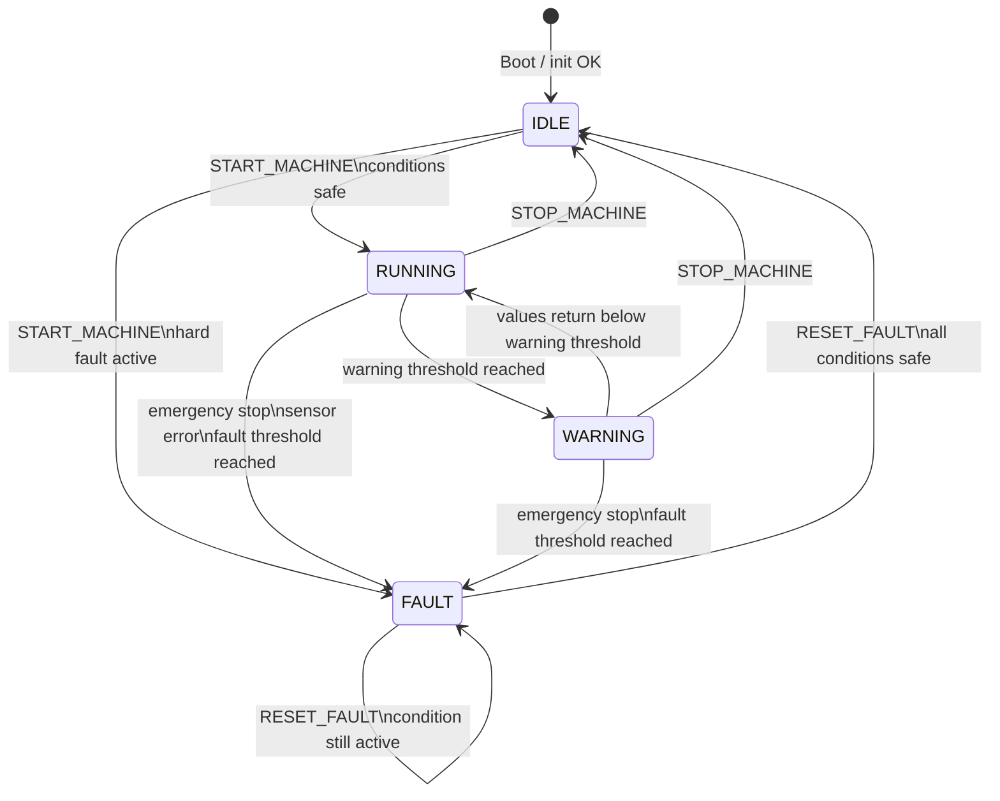

# Machine Monitoring Edge Gateway

Embedded Linux edge gateway running on a Raspberry Pi 5 with a custom Yocto image.

The gateway is the middle layer between the STM32 machine I/O node and the Qt/QML HMI. It communicates with the STM32 over UART, converts machine status frames into structured telemetry, exposes the data through ROS2, and provides ROS2 services for machine control.

## Project Goal

This project demonstrates an embedded Linux edge gateway for a small industrial-style machine monitoring system.

It combines:

* Raspberry Pi 5
* Custom Yocto Linux image
* C++ gateway application
* UART communication with STM32
* Unix socket IPC
* ROS2 Jazzy telemetry and services
* systemd services for automatic startup
* Host-to-target ROS2 communication over Ethernet
* Integration with a Qt/QML HMI

## System Architecture

```text
+------------------------------+
| Qt/QML HMI                   |
| - Live telemetry dashboard   |
| - Machine controls           |
| - Load threshold settings    |
+---------------+--------------+
                |
                | ROS2 over Ethernet
                v
+---------------+--------------+
| Raspberry Pi 5 Edge Gateway  |
| Yocto Linux                  |
|                              |
| ros2-stm32-bridge            |
| - /machine/telemetry         |
| - ROS2 services              |
|                              |
| edge-gateway                 |
| - UART manager               |
| - STM32 protocol parser      |
| - Unix socket IPC server     |
| - command forwarding         |
+---------------+--------------+
                |
                | USART1 / UART
                v
+---------------+--------------+
| STM32 Machine I/O Node       |
| - DHT11 temperature/humidity |
| - Load input                 |
| - Fan PWM + RPM feedback     |
| - Emergency stop input       |
| - Status LED outputs         |
| - Machine state/fault logic  |
| - Optional vibration fields  |
+------------------------------+
```

## Related Repositories

```text
STM32 firmware : https://github.com/anasmansouri/stm32-machine-io-node
Qt/QML HMI     : https://github.com/anasmansouri/machine-monitoring-hmi
```

## Current Hardware Status

The current demo hardware uses:

* STM32 machine I/O node
* DHT11 temperature/humidity sensor
* Load input through ADC
* 4-pin PWM fan with tachometer/RPM feedback
* Emergency stop input
* Red/yellow/green status LED module
* UART link between STM32 and Raspberry Pi
* Raspberry Pi 5 running the Yocto gateway image

The ADXL345 vibration sensor was used earlier and the gateway still supports the vibration telemetry fields for compatibility. In the current hardware demo, vibration values can be kept as `0` when the sensor is disabled on the STM32 side.

## Main Components

### 1. edge-gateway

C++ application running on the Raspberry Pi.

Responsibilities:

* Open and configure the UART device
* Handshake with STM32 using `PING`
* Poll STM32 using `GET_STATUS`
* Parse STM32 `STATUS` frames
* Convert telemetry into JSON snapshots
* Publish snapshots over a Unix socket
* Forward command requests to STM32
* Continue running even if the STM32 is temporarily offline

### 2. ros2-stm32-bridge

ROS2 C++ node.

Responsibilities:

* Read telemetry JSON from the gateway IPC socket
* Publish machine telemetry on `/machine/telemetry`
* Provide ROS2 services for machine control
* Forward service requests to the gateway command socket
* Reconnect when the gateway socket is temporarily unavailable

### 3. machine_interfaces

Custom ROS2 interface package.

It contains:

* `machine_interfaces/msg/MachineTelemetry`
* `machine_interfaces/srv/SetThreshold`

`SetThreshold` is used for configurable warning/fault thresholds such as load threshold and optional vibration threshold.

## Telemetry Pipeline

```text
STM32 sensors and machine state
  -> UART STATUS response
  -> Raspberry Pi edge-gateway
  -> Unix socket JSON snapshot
  -> ros2-stm32-bridge
  -> ROS2 topic /machine/telemetry
  -> Qt/QML HMI
```

Example JSON snapshot:

```json
{
  "type": "machine_snapshot",
  "temperature": 27,
  "humidity": 62,
  "load": 28,
  "fan_rpm": 1200,
  "vibration_x_mg": 0,
  "vibration_y_mg": 0,
  "vibration_z_mg": 0,
  "vibration_level_mg": 0,
  "emergency_button": false,
  "state": "MACHINE_STATE_IDLE",
  "fault": "FAULT_NONE",
  "operating_mode": "AUTO_MODE",
  "dht_status": "DHT_OK",
  "load_status": "LOAD_OK"
}
```

## ROS2 Interfaces

### Topic

```text
/machine/telemetry
```

Message type:

```text
machine_interfaces/msg/MachineTelemetry
```

Fields:

```text
int32 temperature
int32 humidity
int32 load
uint32 fan_rpm
int32 vibration_x_mg
int32 vibration_y_mg
int32 vibration_z_mg
int32 vibration_level_mg
bool emergency_button
string state
string fault
string operating_mode
string dht_status
string load_status
```

The vibration fields are retained for protocol compatibility. When the vibration sensor is disabled on the STM32 side, they are published as `0`.

Example output:

```yaml
temperature: 27
humidity: 62
load: 28
fan_rpm: 1200
vibration_x_mg: 0
vibration_y_mg: 0
vibration_z_mg: 0
vibration_level_mg: 0
emergency_button: false
state: MACHINE_STATE_IDLE
fault: FAULT_NONE
operating_mode: AUTO_MODE
dht_status: DHT_OK
load_status: LOAD_OK
```

### Services

Command services:

```text
/machine/start_machine
/machine/stop_machine
/machine/reset_fault
```

Service type:

```text
std_srvs/srv/Trigger
```

Threshold services:

```text
/machine/set_load_threshold
/machine/set_vibration_threshold
```

Service type:

```text
machine_interfaces/srv/SetThreshold
```

Current HMI usage focuses on `/machine/set_load_threshold`. The vibration threshold service is kept for future re-enabling of the vibration sensor.

Example service calls:

```bash
ros2 service call /machine/start_machine std_srvs/srv/Trigger "{}"
ros2 service call /machine/stop_machine std_srvs/srv/Trigger "{}"
ros2 service call /machine/reset_fault std_srvs/srv/Trigger "{}"
ros2 service call /machine/set_load_threshold machine_interfaces/srv/SetThreshold "{warning: 60, fault: 85}"
```

Optional vibration threshold command:

```bash
ros2 service call /machine/set_vibration_threshold machine_interfaces/srv/SetThreshold "{warning: 2500, fault: 3000}"
```

## UART Protocol

### Commands sent to STM32

```text
PING
GET_STATUS
START_MACHINE
STOP_MACHINE
RESET_FAULT
SET_LOAD_THRESHOLD:WARN=<value>;FAULT=<value>
SET_VIBRATION_THRESHOLD:WARN=<value>;FAULT=<value>
```

`SET_VIBRATION_THRESHOLD` is retained for the optional vibration feature.

### Example responses from STM32

```text
ACK:PING
ACK:START_MACHINE
ACK:STOP_MACHINE
ACK:RESET_FAULT
ACK:SET_LOAD_THRESHOLD
ACK:SET_VIBRATION_THRESHOLD
NACK:UNKNOWN_CMD
NACK:START_MACHINE:NOT_IDLE
NACK:START_MACHINE:FAULT_EMERGENCY_STOP
NACK:RESET_FAULT:NO_ACTIVE_FAULT
NACK:RESET_FAULT:FAULT_EMERGENCY_STOP
NACK:SET_LOAD_THRESHOLD:INVALID_FORMAT
NACK:SET_LOAD_THRESHOLD:INVALID_RANGE
NACK:SET_VIBRATION_THRESHOLD:INVALID_FORMAT
NACK:SET_VIBRATION_THRESHOLD:INVALID_RANGE
STATUS:TEMP=27;HUM=62;LOAD=28;VIB_X=0;VIB_Y=0;VIB_Z=0;VIB_LEVEL=0;fanRPM=1200;emergency_button=0;STATE=MACHINE_STATE_IDLE;FAULT=FAULT_NONE;OPERATING_MODE=AUTO_MODE;DHT_STATUS=DHT_OK;LOAD_STATUS=LOAD_OK
```

## Robust Startup Behavior

The Raspberry Pi can boot even if the STM32 is not powered on.

Behavior:

* `edge-gateway.service` starts normally.
* The gateway keeps sending `PING`.
* UART read timeouts prevent blocking forever.
* When the STM32 is powered on later, the handshake succeeds automatically.
* The gateway switches to normal `GET_STATUS` polling.
* If STM32 disconnects during runtime, the gateway returns to handshake mode.
* The ROS2 bridge also uses IPC read timeouts to avoid blocking forever.

## systemd Services

The Yocto image installs services for automatic startup:

```text
edge-gateway.service
ros2-stm32-bridge.service
```

Check service status:

```bash
systemctl status edge-gateway
systemctl status ros2-stm32-bridge
```

Follow logs:

```bash
journalctl -u edge-gateway -f
journalctl -u ros2-stm32-bridge -f
```

The edge gateway also writes an application log:

```bash
tail -f /var/log/edge-gateway.log
```

## Yocto Build

Enter the Yocto build directory:

```bash
cd build
```

Build the full image:

```bash
bitbake core-image-base
```

Build only the project packages during development:

```bash
bitbake edge-gateway
bitbake machine-interfaces
bitbake ros2-stm32-bridge
```

Image output:

```text
tmp/deploy/images/raspberrypi5/
```

The latest image symlink is usually:

```text
tmp/deploy/images/raspberrypi5/core-image-base-raspberrypi5.rootfs.wic.bz2
```

## Flash Image

Check the SD card device first:

```bash
lsblk
```

Flash the image:

```bash
sudo bmaptool copy tmp/deploy/images/raspberrypi5/core-image-base-raspberrypi5.rootfs.wic.bz2 /dev/sdX
sync
```

Replace `/dev/sdX` with the correct SD card device, not a partition such as `/dev/sdX1`.

## Runtime Test on Raspberry Pi

After booting the Raspberry Pi:

```bash
systemctl status edge-gateway
systemctl status ros2-stm32-bridge
```

Check gateway logs:

```bash
tail -n 50 /var/log/edge-gateway.log
```

Expected log pattern:

```text
PI sent PING
STM32 REPLIES : ACK:PING
PI Sent : GET_STATUS
STM32 REPLIES : STATUS:TEMP=...
```

Source ROS2 on the Yocto target:

```sh
unset AMENT_SHELL
unset AMENT_CURRENT_PREFIX
. /opt/ros/jazzy/setup.sh
export ROS_DOMAIN_ID=7
export ROS_LOCALHOST_ONLY=0
```

Check telemetry:

```bash
ros2 topic list
ros2 interface show machine_interfaces/msg/MachineTelemetry
ros2 topic echo /machine/telemetry
```

Call services:

```bash
ros2 service call /machine/start_machine std_srvs/srv/Trigger "{}"
ros2 service call /machine/stop_machine std_srvs/srv/Trigger "{}"
ros2 service call /machine/reset_fault std_srvs/srv/Trigger "{}"
ros2 service call /machine/set_load_threshold machine_interfaces/srv/SetThreshold "{warning: 60, fault: 85}"
```

## ROS2 Host Communication Test

Direct Ethernet setup:

```text
Host PC:      192.168.50.1
Raspberry Pi: 192.168.50.2
ROS_DOMAIN_ID=7
ROS_LOCALHOST_ONLY=0
```

A ROS2 Jazzy Docker container can communicate with the Raspberry Pi using host networking:

```bash
docker run -it --rm \
  --net=host \
  -e ROS_DOMAIN_ID=7 \
  -e ROS_LOCALHOST_ONLY=0 \
  -v ~/personal_projects/yocto_project/machine-monitoring-edge-gateway:/gateway \
  ros:jazzy-ros-base \
  bash
```

Inside the container:

```bash
source /opt/ros/jazzy/setup.bash
ros2 topic list
ros2 topic echo /machine/telemetry
```

## Machine State

The machine state is controlled by STM32 firmware.

```text
IDLE    -> safe waiting state
RUNNING -> normal operation
WARNING -> warning threshold reached, machine still running
FAULT   -> latched unsafe state, reset required
```

Emergency stop and hard faults have the highest priority and force the machine into `FAULT`.



## Current Status

Working:

* Custom Yocto image boots on Raspberry Pi 5
* Edge gateway starts automatically with systemd
* ROS2 bridge starts automatically with systemd
* UART handshake and telemetry polling work
* STM32 offline/online startup is handled robustly
* Telemetry is published on `/machine/telemetry`
* Start/stop/reset services are available
* Load threshold service is available
* Qt/QML HMI can visualize telemetry and send commands

Current hardware demo:

* Temperature/humidity telemetry
* Load telemetry
* Fan RPM telemetry
* Emergency stop state
* Machine state and fault reporting
* Physical status LEDs
* Load threshold configuration

Optional/future:

* Re-enable ADXL345 vibration sensor and vibration threshold handling
* Add OTA update flow
* Add MQTT/cloud forwarding
* Add metrics storage and Grafana dashboard
